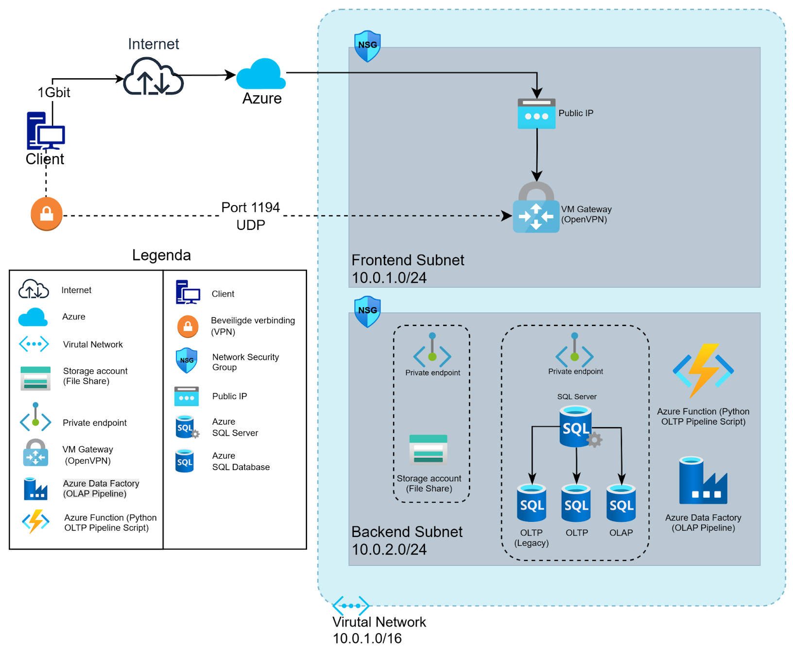

# Case Study: Transforming Data Chaos into Actionable Insights

## The Challenge

Rapid growth led to a fragmented data infrastructure where critical business information was siloed in disconnected legacy systems. The company lacked a central, reliable **'single source of truth'**, making data-driven strategic decision-making impossible.

The mission: to architect and implement a scalable and secure cloud data solution from the ground up.

 

## My Architecture (Visualized)

To solve this, I designed a modern data architecture in Microsoft Azure. The design emphasizes security, scalability, and a clear separation between transactional and analytical workloads.\

*Figure 1: The data architecture I designed in Microsoft Azure, including a segmented VNet, Private Endpoints for security, and the dataflow from OLTP to OLAP.*

 

## My Approach (Strategy & Implementation)

My strategy was built on three core pillars: a secure cloud foundation, rigorous data modeling, and a hybrid approach to data processing.

*   **Cloud Architecture & Security:** I designed and implemented the entire secure Azure environment (VNet, Subnets, NSGs) from scratch. I implemented a **'defense-in-depth'** security strategy using an OpenVPN gateway and Private Endpoints to completely isolate all critical data assets from the public internet.

*   **Data Modeling & Analysis:** I conducted an in-depth comparative analysis between two OLTP models. Based on this, I designed a superior, hybrid data model that was both functionally complete (**3NF-compliant**) and analytically powerful and scalable for future needs.

*   **Hybrid ETL Strategy:** I engineered the end-to-end dataflow using two specialized pipelines: a custom **Python/Pandas ETL script** for the complex, one-time cleaning of legacy data, and a robust, automated **Azure Data Factory pipeline** for the daily data processing into the OLAP environment.

 

## The Result (Impact)

The project resulted in a successful transition from data chaos to a fully validated 'single source of truth'.

This **empowers the management team**, for the first time, to make strategic decisions based on reliable, consistent, and up-to-date data. The solution provides a direct and measurable impact on the company's ability to operate strategically and leverage its data as a valuable asset.

 

---

### Technologies & Concepts

`Microsoft Azure` `Azure Data Factory (ADF)` `Azure SQL` `Python (Pandas)` `ETL` `Data Warehousing (OLTP/OLAP)` `Data Modeling (ERD, 3NF, Star Schema)` `VNet Security & NSGs` `Private Endpoints` `Defense-in-Depth`
